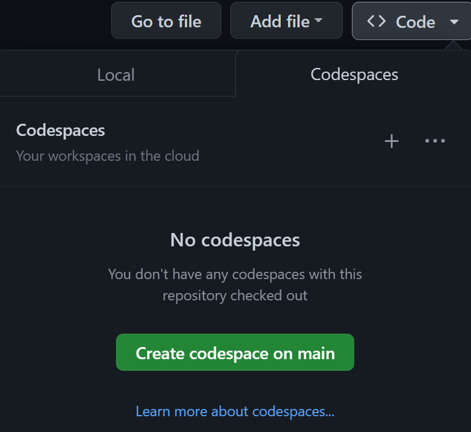

[](https://github.com/codespaces/new?hide_repo_select=true&ref=main&repo=526682619)

# MLSA 2024 상반기 FE 체험부스
# Microsoft Azure Static App으로 나만의 리액트(React) 포트폴리오 사이트 만들기

몇 분 만에 자신만의 포트폴리오 웹사이트를 생성, 사용자 정의 및 배포할 수 있습니다. ✨


### 하나하나 따라하며 만들어 볼까요?

1. 아래 이미지처럼 **Use this Template** 버튼을 누르고 **Create a new repository** 버튼을 누릅니다.
   참고: GitHub에 로그인했는지 확인하세요. 그렇지 않으면 이 템플릿 사용 버튼이 표시되지 않습니다.

2. 새 저장소의 고유한 이름을 입력하세요.
3. 새로 생성된 저장소의 메인 페이지로 이동합니다.
4. 저장소 이름 아래에서 코드 드롭다운 메뉴를 사용하고 Codespaces 탭에서 "Create codespace on main"을 선택합니다.

    


4. GitHub가 Codespace를 초기화하는 동안 기다립니다.

    

5. 완료되면 하단에 터미널 섹션이 있는 Codespace 로드가 표시됩니다. Codespaces는 npm install을 통해 컨테이너에 필요한 모든 확장을 설치한 후, 패키지 설치가 완료되면 Codespaces가 실행되어 npm start를 통해 Codespace 내에서 실행되는 웹 애플리케이션을 시작합니다.

웹 애플리케이션이 성공적으로 시작되면 서버가 Codespace 내의 포트 1234에서 실행되고 있다는 메시지가 터미널에 표시됩니다.

   

키보드의 CTRL을 누른 상태로 `http://localhost:1234`을 마우스 왼클릭 하시면 웹사이트가 새로운 브라우저에서 열리게 됩니다.

<br />

## ✨ 이제 사이트를 꾸며봅시다!

### 1️⃣ "내 소개"와 소셜 계정을 추가하세요

/src/App.jsx 파일을 클릭하면 siteProps 이라는 변수가 보일 것입니다. 이는 이름, 직위, 이메일 및 소셜 계정을 사용자 정의하는 JavaScript 개체입니다.

```javascript
const siteProps = {
  name: "Yeachan Kim",
  title: "FrontEnd Developer & MLSA",
  email: "Yeachan.Kim@studentambassadors.com",
  gitHub: "Yeachan-Kim",
  instagram: "MLSA_KNU",
  linkedIn: "MLSA_KNU",
  medium: "MLSA_KNU",
  twitter: "MLSA_KNU",
  youTube: "MLSA_KNU",
};
```

위 형식에 맞게 자유롭게 오른쪽 부분을 변경해주세요! (EX. name: "Minjin Park")

작성할 내용이 없다면 빈 문자열("")로 남겨두면 됩니다.

빈 문자열("")로 설정된 항목이 있으면 아이콘과 링크가 표시되지 않습니다.

수정을 마치면 자동으로 웹 사이트가 변경이 됩니다.

만약 변경이 되지 않는다면 웹사이트를 새로고침 하시거나 다시 여시면 됩니다!

### 2️⃣ 배경 이미지를 바꿔 볼까요?

이 포트폴리오 사이트에는 1. `상단 섹션` 배경 2.`내 소개` 배경 3. `포트폴리오` 배경 총 3가지 이미지가 포함되어 있습니다.

사진은 `/src/images` 폴더에 있는 사진들 중 마음에 드는 걸로 고르시면 됩니다!

만약 images 폴더 안에 dog.jpg 이미지를 선택하고 싶은 경우

import image from "../images/server-wall.jpg"; -> import image from "../images/dog.jpg";

와 같이 이미지를 선택해주고

const imageAltText = "서있는 여성의 이미지"; -> const imageAltText = "강아지 사진";

와 같이 이미지 설명을 변경하시면 됩니다.

아래의 3곳을 변경해주세요!

* `/src/Components/Home.jsx` - 페이지 상단 섹션(여성 얼굴 이미지)
   ```javascript
      import image from "../images/server-wall.jpg";
      const imageAltText = "서있는 여성의 이미지";
   ```
* `/src/Components/About.jsx` - "내 소개" 섹션 뒤의 배경(추상적인 이미지)
   ```javascript
      import image from "../images/mosaic.svg";
      const imageAltText = "보라와 파란색의 모자이크 이미지";
   ```
* `/src/Components/Portfolio.jsx`- 포트폴리오 섹션 왼쪽에 표시된 이미지(책과 필기도구 이미지)
   ```javascript
      import image from "../images/design-desk.jpeg";
      const imageAltText = "책과 필기도구 이미지";
   ```

### 3️⃣ 자기소개를 작성해 볼까요?

자기소개 섹션을 수정해봅시다!

`/src/Components/About.jsx` 파일 안에 3곳을 변경해봅시다!

* `description`: 자신, 경력 목표 및/또는 열정을 설명하는 짧은 문장 1~2개
* `skillsList`: 자신이 가지고 있는 능력
* `detailOrQuote`: 자신에 대한 자세한 내용이나 좋아하는 인용문을 추가할 수 있는 긴 블록
```javascript
const description =
  "경북대학교에서 사람들에게 MS의 기술을 전파하고 있는 MLSA 김예찬입니다.";
const skillsList = [
  "Web design",
  "User experience",
  "Inclusive design",
  "Focus group testing",
  "Mobile user interfaces",
  "Graphic design",
];
const detailOrQuote =
  "세상에 두려울 것은 없다. 모르는 것일 뿐";
```

다음으로는 포트폴리오 섹션을 수정해봅시다!

`/src/Components/Portfolio.jsx` 파일로 가서 `projectList` 변수를 변경해봅시다

샘플에는 4개의 프로젝트가 있지만 본인 마음대로 갯수를 늘리고 줄일 수 있어요!

```javascript
const projectList = [
  {
    title: "Azure Static Web Apps 🎉에 대해 알아야 할 10가지",
    description: "초보자 친화적인 사람을 만들기 위한 협력....",
    url: "https://dev.to/azure/10-things-to-know-about-azure-static-web-apps-3n4i",
  },
  {
    title: "초보자를 위한 웹 개발",
    description: "기여한 스케치 노트 이미지...",
    url: "https://github.com/microsoft/web-dev-for-beginners",
  },
  {
    title: "나의 이력서 사이트",
    description: "마이크로소프트의 이력서 워크샵에서 작성...",
    url: "https://github.com/microsoft/workshop-library/tree/main/full/build-resume-website",
  },
  {
    title: "GitHub Codespaces and GitHub.dev",
    description: "Video interview to explain when to use GitHub.dev...",
    url: "https://www.youtube.com/watch?v=c3hHhRME_XI",
  },
];
```

<br/>

## 🏃 이제 배포를 해 봅시다!

저희는 [Azure Static Web Apps](https://azure.microsoft.com/products/app-service/static/?WT.mc_id=academic-79839-sagibbon)을 이용해서 무료로 배포를 해볼겁니다!

### Azure Static Web Apps이란 무엇인가?

Azure를 통해 정적 사이트(또는 사용자의 브라우저에서 렌더링되는 사이트)를 위한 Microsoft의 호스팅 솔루션입니다.

웹 애플리케이션을 배포하려면 Azure 및 GitHub 계정이 모두 필요합니다. 아직 Azure 계정이 없으면 배포 프로세스 중에 또는 아래 링크에서 만들 수 있습니다.

* [Azure 학생 계정 만들기(카드필요없음)](https://azure.microsoft.com/free/students/?WT.mc_id=academic-79839-sagibbon)

<br/>

### 수정사항 업데이트 하기

모든 수정이 끝났으면 왼쪽 사이드바에서 `소스 제어`를 클릭합니다.


`커밋 버튼`위 빈칸에 `update`를 작성한 후 `커밋 버튼`을 눌러줍니다. (스테이징~ 라고 나오면 확인을 눌러줍니다)


커밋할 스테이징된 변경 사항이 없습니다. 모든 변경 사항을 스테이징하고 직접 커밋하시겠습니까?

라고 나온다면 `예`를 눌러줍니다.


`변경 내용 동기화`를 눌러주시고 확인을 눌러줍니다.


<br/>

### Azure로 세상에 나의 홈페이지 배포하기

1. 왼쪽 사이드바에서 Azure 아이콘을 클릭합니다. 아직 로그인하지 않은 경우 로그인하고, Azure를 처음 사용하는 경우에는 프롬프트에 따라 계정을 만듭니다.
2. Azure 메뉴에서 "+" 기호를 클릭한 다음 "Create Static Web App"를 클릭합니다.
3. GitHub에 로그인하지 않은 경우 로그인하라는 메시지가 표시됩니다. 로그인 해주시면 됩니다.
4. 보류 중인 파일 변경 사항이 있는 경우 해당 변경 사항을 커밋하라는 메시지가 표시됩니다. 허락 해주시면 됩니다. `Commit made from VS Code Azure Static Web Apps` 라고 뜬다면 Enter 누르시면 됩니다.
5. 메시지가 표시되면 애플리케이션 정보를 설정합니다.
      1. **Name**: `myWebSite`라고 작성해주세요.
      2. **Region**: `East Asia` 지역을 선택하세요.
      3. **Project structure**: `React`를 선택하세요.
      4. **Location of application code**: `/` 라고 작성해주세요
      5. **Build location**: `dist` 라고 작성해주세요.
7. 완료되면 화면 하단에 알림이 표시되고 새로운 GitHub Action 워크플로가 프로젝트에 추가됩니다. “GitHub에서 액션 열기”를 클릭하면 생성된 액션이 현재 실행 중인 것을 볼 수 있습니다.

8. 배포 상태를 보려면 VS Code 왼쪽 막대의 Azure 탭에서 정적 웹앱 리소스를 찾으세요.
9. 배포가 완료되면 `myWebSite`를 마우스 오른쪽 버튼으로 클릭하고 "Browse Site"를 선택하여 공개적으로 액세스할 수 있는 새로운 애플리케이션을 볼 수 있습니다.
10. (기본 마이크로소프트 홈페이지가 뜬다면 1~2분뒤 새로고침 해보세요, 업로드에 시간이 걸립니다.) 

11. `myWebSite`를 우클릭하고 "Open in Portal"을 클릭해서 Azure portal에서 자세한 내용을 확인하실 수 있습니다.

> **오류가 뜨나요?** 정적 웹 앱을 만들 때 Azure 구독을 선택하라는 메시지가 표시되고 구독을 선택할 수 없는 경우 VS Code에서 "계정" 탭을 확인하세요. 해당 옵션이 나타나면 "...에 액세스 권한 부여" 옵션을 선택하십시오.

> 🤩 **보너스(선택)**: [Azure Static Web App용 사용자 지정 도메인 만들기](https://learn.microsoft.com/en-us/shows/azure-tips-and-tricks-static-web-apps/how-to-set-up-a-custom-domain-name-in-azure-static-web-apps-10-of-16--azure-tips-and-tricks-static-w/?WT.mc_id=academic-79839-sagibbon)

### 수정 및 업데이트
웹사이트를 수정하고 싶다면 바꾸고 싶은 부분을 변경하고

`소스 제어` -> `커밋 메세지 작성` -> `커밋 버튼 클릭` -> `동기화`

의 과정을 해주시면 자동으로 웹사이트가 업데이트 됩니다!

## 완성!
힘든 여정을 따라오느라 고생하셨습니다.

이제 여러분은 여러분만의 홈페이지를 가지게 되셨습니다!

친구들에게 웹사이트 링크를 보내주며 자랑해보세요!

### 추가적인 정보가 필요하다면??
[FE 세션_질문에_대한_대답 보러가기](https://github.com/Yeachan-Kim/MLSA-FE-EVENT/blob/main/MLSA%20%EC%83%81%EB%B0%98%EA%B8%B0%2024%EB%85%84%EB%8F%84%203.22%20%ED%96%89%EC%82%AC%20FE%20%EC%84%B8%EC%85%98_%EC%A7%88%EB%AC%B8%EC%97%90_%EB%8C%80%ED%95%9C_%EB%8C%80%EB%8B%B5.pdf)


<!-- 여기부턴 주석처리
### GitHub Pages

[GitHub Pages](https://pages.github.com/) allows you to host websites directly from your GitHub repository. This project is already set up for you to get your portfolio deployed to GitHub pages with minimal steps.

With your project open in Codespaces:

1. Open `package.json` and update the following values:
    1. **homepage**: set to `http://{github-username}.github.io/{repo-name}`, where `github-username` is your GitHub username and `repo-name` is the what you named this portfolio repo when you created it
    1. **build-gh**: replace `github-username` with your GitHub username and `repo-name` with the repository name
1. Commit and push those changes to `package.json` to your GitHub remote repo.
1. Open a new terminal from the menu or by pressing `ctrl` + `shift` + ` (or open top left menu, select "Terminal" and "New Terminal")
1. Within the terminal window run `npm run deploy`. This will first run the pre-deploy script to build the project, followed by the deploy script that will push those bundled files to a new branch on your repo (gh-pages) that will be used for you GitHub Pages site.
1. When completed, within your repo, go to Settings and Pages. There you will see that a page has been set up to for you against the gh-pages branch, and you should see the URL (that should match the “homepage” value you set in package.json)


> 🤩 **Bonus**: [Setup a custom domain for your GitHub pages site](https://docs.github.com/en/pages/configuring-a-custom-domain-for-your-github-pages-site/managing-a-custom-domain-for-your-github-pages-site)

<br />

## 🏆 Customizing with Copilot

Below are 4 additional ways you can continue to customize your Codespace and portfolio site. We'll show you how to use Copilot to make suggestions for faster development, and help you learn more HTML, CSS and JavaScript along the way.

  1. [Customize your Codespace](#1-customize-your-codespace)
  1. [Update to smooth scroll to a section](#2-update-to-smooth-scroll-to-a-section)
  1. [Animate the desk photo](#3-animate-desk-photo)
  1. [Add a new section](#4-add-a-new-section)

> 👋 Getting Copilot access
>
> If you don't yet have Copilot access, you can [request it here](https://github.com/login?return_to=%2fgithub-copilot%2fsignup). If you are a student, you can get Copilot for **FREE** [following these instructions](https://techcommunity.microsoft.com/t5/educator-developer-blog/step-by-step-setting-up-github-student-and-github-copilot-as-an/ba-p/3736279?WT.mc_id=academic-0000-sagibbon).
>
> To ensure that Copilot is running correctly, navigate to the extension tab in your Codespace and check the status of the Copilot extension. If the status is inactive, recreate the Codespace, and enable the extension to ensure that it is activated.

### 1. Customize your Codespace

Your environment comes with preinstalled extensions. You can change which extensions your Codespaces environment starts with, here's how:

1. Open file _.devcontainer/devcontainer.json_ and locate the following JSON element **extensions**

   ```json
   "extensions": [
        "dbaeumer.vscode-eslint",
        "esbenp.prettier-vscode",
        "gitHub.copilot",
        "ms-vscode.azure-account",
        "ms-azuretools.vscode-azurestaticwebapps"
   ]
   ```

1. Let's add the `indent-rainbow` extension. To do this, go to the **extensions** list and add:

   ```json
   "oderwat.indent-rainbow"
   ```

   What you did above was to add the unique identifier of an extension of the [indent-rainbow](https://marketplace.visualstudio.com/items?itemName=oderwat.indent-rainbow&WT.mc_id=academic-79839-sagibbon). This will let Codespaces know that this extension should be pre-installed upon startup.

To find the unique identifier of an extension:

* Navigate to the extension's web page, like so [marketplace.visualstudio.com/items?itemName=oderwat.indent-rainbow](https://marketplace.visualstudio.com/items?itemName=oderwat.indent-rainbow&WT.mc_id=academic-79839-sagibbon)
* Locate the _Unique Identifier_ field under **More info** section on your right side.

-------
⭐ COPILOT BONUS ⭐


In `devcontainer.json`, go to the following line in the `settings` values: `"emmet.triggerExpansionOnTab": true`. Add a comma at the end of the line and press enter. See what other settings Copilot recommeneds and if they'd help you in your Codespace.


> 💡 Learn more on how to [Personalize Your GitHub Codespace](https://docs.github.com/codespaces/customizing-your-codespace/personalizing-github-codespaces-for-your-account)

<br/>

### 2. Update to smooth scroll to a section

In your site header you have links to each section below. Click one of these links and watch it scroll the page to that section. Not really a scroll, right?

Let's make this a better user experience by slowing that down so the user has a sense of what is happening, and where they are navigating to on the page.

1. Open `styles.css`, which is the stylesheet for your portfolio application. We need to add a style for `html`. If you look, you'll see right now `html` and `body` styles are being set together, with no style set for `scroll-behavior`. Let's give Copilot a prompt to add this for us.

1. Below the `html` and `body` styling prompt Copilot with a comment of:
`/* add a smooth scroll */`

1. Copilot will then suggest the CSS below:
    ```css
    html {
      scroll-behavior: smooth;
    }
    ```
1. Press the tab key to accept the suggestion. (_Note: If you don't see this exact suggestion from Copilot, continue typing it to get the suggestion to appear._)

Your site should already be running in your Codespace, and the change will reload onto the page automatically. Click a link in the top header to see the smooth scroll in action.

<br/>

### 3. Animate desk photo

Animations are a way you can easily add some motion to elements on your page to increase user interactivity and highlight items you want to make sure they notice. Let's animate the desk photo in the portfolio section.

1. Open your site's stylesheet, `styles.css` within your Codespace. Using Copilot, at the bottom of your `styles.css` prompt Copilot with the following comment:
    ```css
    /* add a slide In Left animation */
    ```

    It should then suggest the following animation sequence for you. Press the tab key to accept, or continue to type until Copilot completes suggestions, and you have your animation ready to use.
    ```css
    @keyframes slideInLeft {
      0% {
        transform: translateX(-100%);
      }
      100% {
        transform: translateX(0);
      }
    }
    ```
1. With the animation sequenece defined, we can now tell our desk photo to animate itself with our new `slideInLeft` animation sequence. Open `Portfolio.jsx` and locate the `img` tag. You will see it utilizes inline CSS to set it's styling. Within it's style definition add the following:
    ```css
    animation: "1s ease-out 0s 1 slideInLeft";
    ```

    Your image tag should look something like:
    ```html
    
    ```

Your site should already be running in your Codespace, and the change will reload onto the page automatically. Scroll up and down the page and watch your desk photo slide onto the page.


-------
⭐ COPILOT BONUS ⭐

Use Copilot to help you animate the scroll down arrow in your `Home` component to bounce up and down on your page.

_Hint_: In your `styles.css` file, use comments to start to tell Copilot what you want to do. See what is suggests, adjust your prompts, and see how it guides you to get your arrow to bounce.

-------

<br/>

### 4. Add a new section

We started you off with a few basic sections for your portfolio site, but you have creative freedom to make it your own and add new sections relevant to what you want on your site.

For an example, let's add an education section to your portfolio site.

1. Create a new component for the section within the `Components` folder. Add a new file called `Education.jsx`.

1. Let's have Copilot help get us started. Instead of prompting with a comment, start your `Education.jsx` file with:
    ```javascript
    import React from "react";
    ```

    As you start typing it will pick up what you are doing and may offer an autocomplete of that line.

1. Press `enter` after the import line to have Copilot suggest code to create your `Education` component. Press `tab` to accept the solution or `crtl` + `enter` to view all Copilot suggestions and select the one that works for you.

    At minimum, you need a `const` defined and the `Education` component exported (example below). The rest is up to you. Experiment with Copilot, nudging it along with what you'd like it to build out.
    ```javascript
    import React from "react";

    const Education = () => {
        return(
            <section className="light" id="education">
                <h2>Education</h2>
            </section>
        )
    }

    export default Education;
    ```
3. In `App.jsx` import your new `Education` component at the top by adding the following, and watch as Copilot starts to see what you are doing and give you auto-complete suggestions:
    ```javascript
    import Education from "./Components/Education";
    ```
4. Now add the `Education` component by going to a new line where you want it rendered. Watch Copilot already know you want to render the `Education` component. It should suggest the following that you can accept, and will render your new component:
    ```javascript
    <Education />
    ```

In your Codespace, your portfolio application should be running and will reload your site with the changes.

-------
⭐ COPILOT BONUS ⭐

Now that you are familiar how Copilot can not only help you code faster, but give you suggestions to save you time looking up solutions.

Explore how you can use Copilot to help you:
* add Education to your top navigation
* build education details by prompting it (_Hint_: add the comment of "grid of 4 education cells")
-------

<br />

## 📚 Resources

* [GitHub Codespaces docs overview](https://docs.github.com/codespaces/overview)
* [GitHub Codespaces guides](https://docs.github.com/en/codespaces/guides)
* [GitHub Copilot docs](https://docs.github.com/en/copilot)
* [Use dev containers locally with VS Code and Docker](https://github.com/microsoft/vscode-remote-try-node#vs-code-dev-containers)
* [Web Development for Beginners](https://github.com/microsoft/Web-Dev-For-Beginners)
* [Get started with React](https://learn.microsoft.com/en-us/training/modules/react-get-started/?WT.mc_id=academic-79839-sagibbon)

> #### Codespaces Browser App
>
> If you are using Edge or Chrome you will see an option to install the Codespaces app when you launch your Codespace. The Codespaces app lets you launch your Codespace within the app so you can work outside of the browser.  Look for the app icon and install pop-up to try it out.
>
> 

<br />

## 🔎 Found an issue or have an idea for improvement?
Help us make this template repository better by [letting us know and opening an issue!](/../../issues/new).
-->
